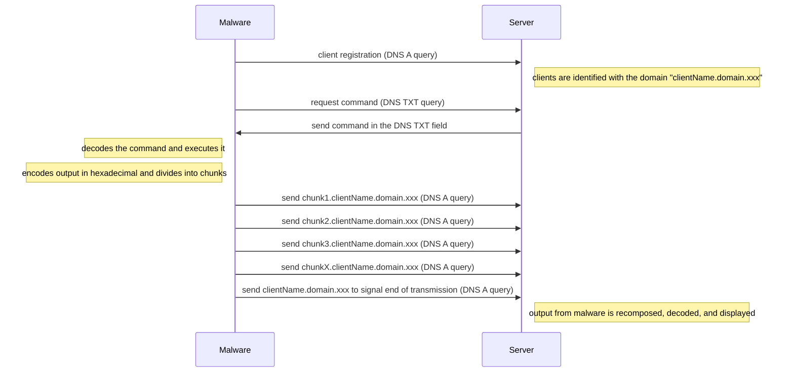
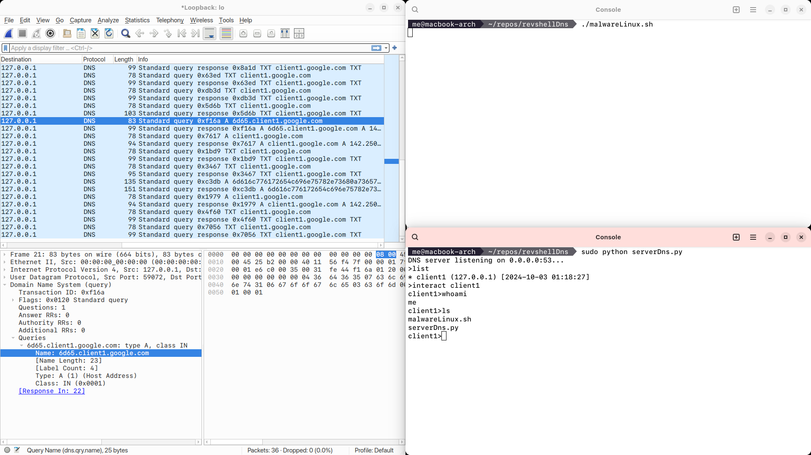

# revshellDns (WIP)

Simple reverse shell using DNS tunnel (educational purposes only).

## Concept

## Demo

In this case, the malicious server is configured to interact with clients using the "*.google.com" domain.

Clients can register by sending a DNS request for "clientName.google.com".  
Commands are sent to clients via DNS TXT requests.  
Responses are sent in chunks to the fourth-level domain (e.g., "chunk.clientName.google.com") by performing type A DNS queries.

Once all the chunks that make up a message have been sent, the malware sends a final type A request to the server with the "clientName.google.com" domain.  
The server interprets this as the end of the message, assembles the chunks, decodes the message, and prints it on the screen.

DNS queries will appear to be made for a legitimate second-level domain (google.com) and will be more difficult to detect

If the server receives any other type of DNS request, it forwards the query to a legitimate DNS server (Google's DNS servers are configured by default).  
This allows it to respond legitimately while masking its true intent.

## Notes

- the reverse shell is built to send data via all tools that do not use eDNS (for example Windows Nslookup or Linux Dig)
- unlike other reverse shells, hexadecimal encoding is used as it is compliant with the DNS name standard (chunks include only numbers and letters, not case sensitive)
- The reverse shell was created for educational purposes only so at the moment it does not use advanced DNS libraries and does not transmit encrypted data
- the code still contains some problems that will be fixed in the future
- a Linux client is included with some features that simulate those of malware (dynamic sleep time, timeout settings etc.)

## TODO
- Add more info to this README
- Windows Batch client
- Windows Powershell or C# client
